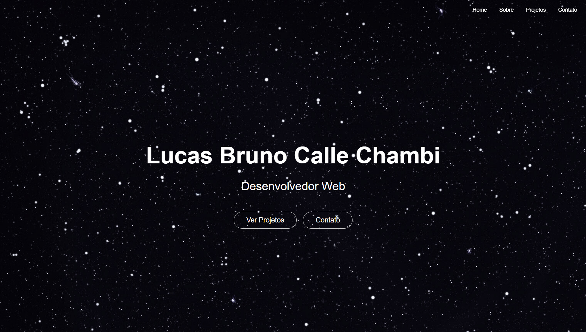

# Portifólio - Lucas Chambi

    Boas-vindas ao meu portifólio! 
    
    Este projeto é a minha plataforma para compartilhar um pouco sobre quem eu sou, o que sei fazer e o trabalho que venho realizando. 
    
    Ele foi construído com foco em performance e experiência do usuário, utilizando as mais modernas tecnologias do ecossistema JavaScript.

# Tecnologias utilizadas: 
    1. NEXT.JS - renderização do Lado do Servidor (SSR) e Geração de Sites Estáticos (SSG).
    2. REACT - a biblioteca base para a construção.
    3. TailwindCSS - responsividade e estilo moderno. 
    4. Vercel - para deploy de projeto.

#

[**Portfólio - Lucas Chambi**](https://portfolio-lucas-chambi.vercel.app/)

